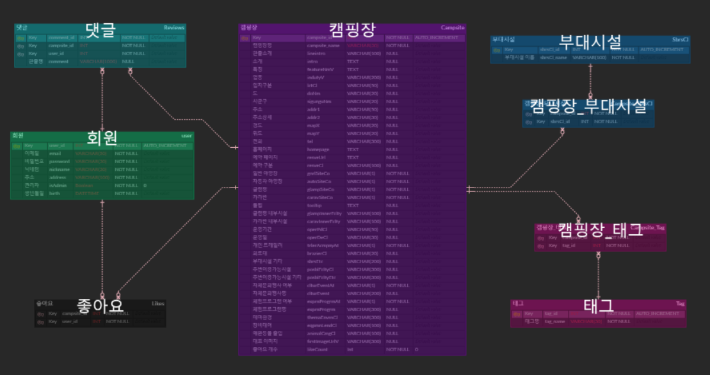

# 캠퍼스(Camping For Smart)

---

[TOC]

---


## Intro

> 2021년 SSAFY 2학기 특화프로젝트로 `캠퍼스`라는 캠핑장 추천서비스를 개발하였다.
>
> 개발기간: 2021년 3월 1일 - 2021년 4월 16일
>

### Service

- 태그에 맞게 캠핑장을 추천해주는 **Content based Filtering**을 제공한다.
- 사용자별로 가장 우선순위의 캠핑장을 추천해주는  **Collaborative Filtering**를 제공한다.

### Compatibility

- Front-end `openjdk 11.0.9.1`, `npm 6.14.10`, `vue/cli 4.5.19` 버전에서 테스트되었다.
- Back-end `python 3.6.8`,`django 3.7.1` 버전에서 테스트 되었다.
- We tested the code using `openjdk 11.0.9.1`, `npm 6.14.10`, `vue/cli 4.5.19`.
- 데이터베이스는 `MySQL 8.0.22`에서 작성되었다.
- We created database using `MySQL 8.0.22`
- AWS EC2를 이용하여 프로젝트를 서버에 배포하였다.
- We deployed project using AWS EC2.

## Data Analysis(데이터 전 처리)
- Data Analysis폴더 안 **read me** 파일 확인

## 서비스 소개

> `캠퍼스` 플랫폼에서는 크게 **캠핑장 추천 , 검색**의 2가지 세부서비스를 제공한다.
>
> - In this platform, users can utilize 2 services of `recommend`, `Search`

**Main Page**

- 메인 페이지로는 **추천태그별 캠핑장 리스트**가 띄워지게 된다.


- 로그인과 회원가입을 을 통해 개인별 추천서비스를 받을 수 있고, 좋아요와 댓글을 남길 수 있다.


- 캠핑장 클릭시 Detail UI


### 1. 키워드 검색

- 태그가 아닌 일반검색으로 검색하면 해당 검색어를 포함된(이름또는 지역) 캠핑장 리스트가 출력된다.


### 2. 태그로 검색

- 태그로 검색하게 되면, 캠핑장의 태그가 해당태그인 리스트를 출력 한다.


## 설치 안내

> `git clone`을 한 후 아래의 작업을 진행해야 프론트 서버를 실행할 수 있다.

**1단계: npm 설치**

- `frontend` 프로젝트 폴더에서 npm을 설치한다.

```bash
npm install
npm run serve
```

**2단계: 환경변수 설정**

- `frontend` 폴더 내의 최상위 창에서 환경변수 `.env.local`이라는 파일을 생성한다.

- 환경변수로 관리하는 데이터는 다음과 같다.

  ```markdown
  ## .env.local
  
  VUE_APP_SERVER_URL=<서버 URL>
  VUE_APP_MAP_API_KEY=<카카오 지도 API Javascript 키>
  VUE_APP_SERVER_URL_C=<크롤링 서버 URL>
  ```
  
- `backend` 프로젝트 폴더에서 모듈을 설치한다.
```bash
pip install -r requirements.txt
python manage.py runserver
```

> 


## File Manifest

>**Naming Rule**
>
>- 파일 명은 `PascalCase`를 따른다.
>- 변수 및 함수명은 `snake_case`를 따른다.

### Frontend

- 폴더 구조는 `member`, `app`, `campsite`로 구분한다.

  ```markdown
  1. member
  - 회원계정 관련
  2. app
  - 메인페이지
  3. campsite
  - 캠핑장 추천 서비스 관련

### Backend


 -폴더구조는 서버 `Back-end`, 앱 단위 `main`, `camp`로 구분된다.
 
    
    1. DB 연동
    - python manage.py inspectdb (db 감지 및 model.py 코드 작성 용이)
        
    2.DB가 변경 되었을 시
    - python manage.py makemigrations
    - python manage.py migrate


### Database

### ERdiagram



## 저작권 및 사용권 정보

- 캠핑장 추천에서 사용되는 캠핑장 정보는 한국관광공사에서 제공하는 [캠핑장 정보 API]( http://api.visitkorea.or.kr/openapi/service/rest/GoCamping/basedList)를 활용하였다.


```markdown
- axios
- lodash
- vue bootstrap-vue bootstrap
- less less-loader
- mint-ui -S
- vue-awesome-swiper
- vuex
```


## 해결한 버그

> 코드를 서버에 올렸을 때 발생하는 주요 버그 및 그에 대한 해결법을 정리하였다.

**:Aws에 띄운 mysql과 Django가 연결되지 않는다.**

**원인**

- 계정에 대한 권한문제

**해결방안**

- 계정을 새로 생성하고, 해당 스키마에 대한 권한을 부여하여 해결했다.


## 알려진 버그

> 아직 없습니다.


## 배포


> https://j4a304.p.ssafy.io


***Copyright* © 2021 SSAFY_SEOUL3_TEAM4_캠퍼스**

